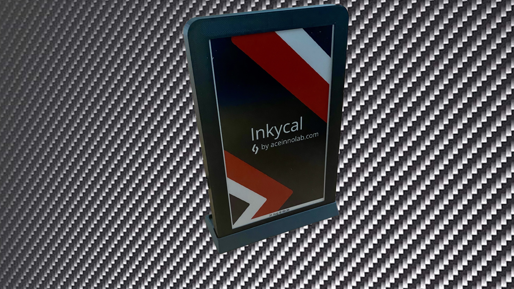
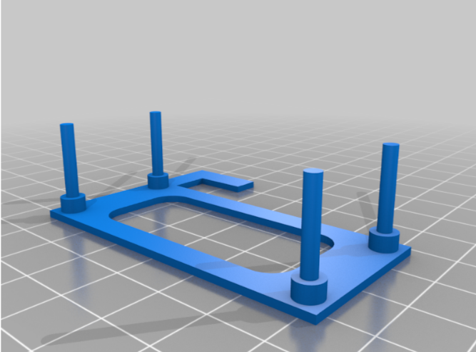
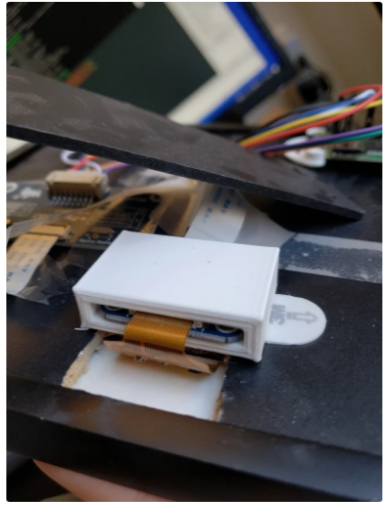

# 🖨️ 3D-Printable Cases & Accessories

These are the most useful community-made cases and holders for InkyCal builds.
They are especially handy if you want a cleaner frame, a battery-powered setup, or a more compact desktop build.

## Featured designs

-   :material-printer-3d: **Inkycal PiSugar Frame**

    Official MakerWorld design by **aceisace**.

    A custom frame for Pi Zero + PiSugar + e-paper display.

    

    [Open design](https://makerworld.com/en/models/622553#profileId-546730)

-   :material-home-variant: **IKEA Frame Mounting Parts**

    Community design by **Ribitsch**.

    A simple mounting set for turning a standard frame into an InkyCal display.

    

    [Open design](https://www.thingiverse.com/thing:4159363)

-   :material-monitor: **Waveshare E-Paper Display HAT Holder**

    Community design by **eboda**.

    A minimal sleeve and stand for desktop display use.

    

    [Open design](https://www.thingiverse.com/thing:4256591)

## Printing notes

- **PLA** is fine for indoor use; **PETG** is better if the frame sits in a warm place.
- A **0.2 mm layer height** is a good default.
- Use **15–20% infill** unless the design asks for more.
- Check supports before printing large front covers or clips.

## Related links

- [Hardware setup](hardware.md)
- [Hall of Fame](hall-of-fame.md)
- [Discord support](https://discord.gg/sHYKeSM)
