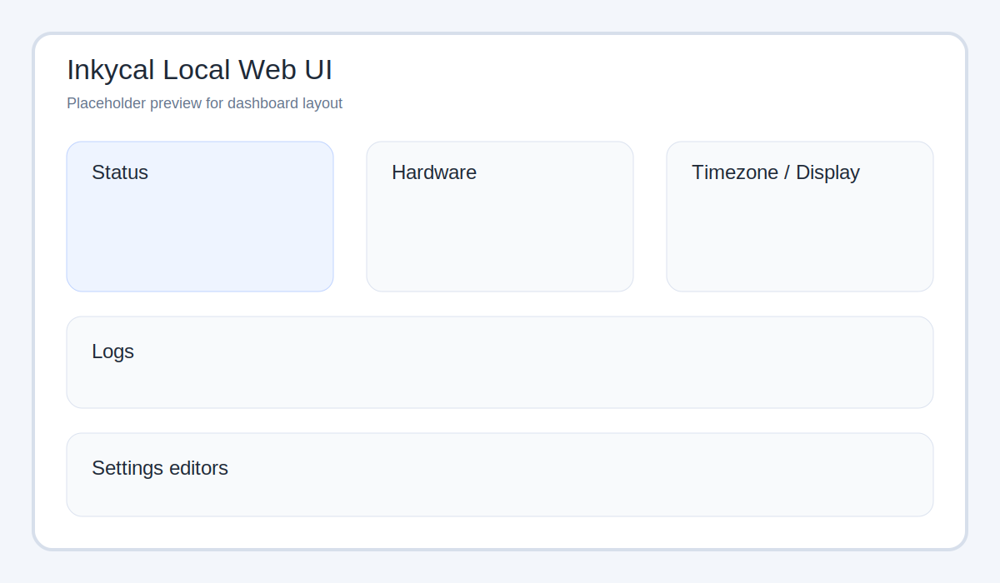
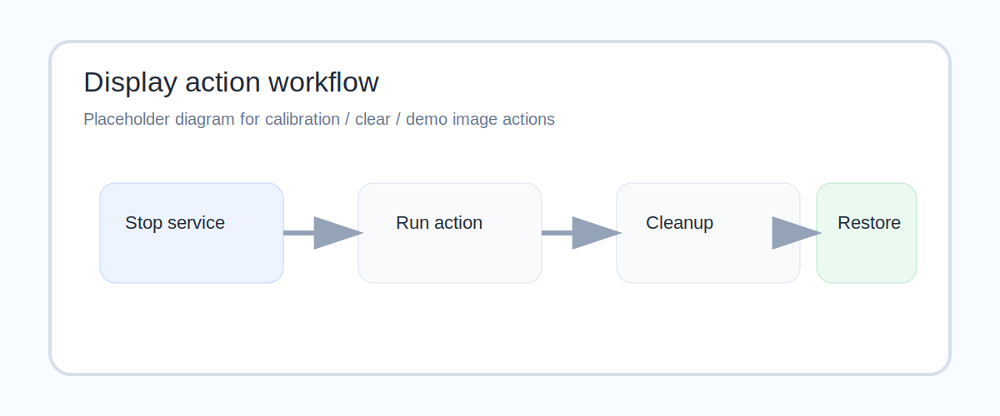

# Local Web UI

The local web UI is a lightweight control panel for a running Inkycal device.
It is designed for phone and desktop browsers and runs separately from the main `inkycal.service`.



## What it can do

The current local web UI supports:

- start, stop and restart the `inkycal.service`
- run a dry-run render without touching the display
- view recent log files
- auto-refresh hardware details while the page is open
- show host, platform, Python version, timezone, load, memory and uptime
- update the system timezone
- inspect and edit `settings.json`
- edit settings as key/value fields with read-only keys
- show the currently selected display model from `settings.json`
- generate and display a PayPal QR code
- launch display actions:
  - calibration
  - clear
  - show demo image

## How it is started

The installer creates a dedicated `systemd` service:

- `inkycal-webui.service`

That service runs `inky_webui.py`, which starts the lightweight HTTP server implemented in `inkycal/webui.py`.

## Default address

By default the web UI listens on:

```text
http://127.0.0.1:8080
```

Many users expose it on the Pi's local network through the installer-managed service configuration.

## Important environment variables

| Variable | Purpose | Default |
|---|---|---|
| `INKYCAL_WEBUI_HOST` | Bind address | `127.0.0.1` |
| `INKYCAL_WEBUI_PORT` | HTTP port | `8080` |
| `INKYCAL_SERVICE_NAME` | Main service controlled by UI | `inkycal.service` |
| `INKYCAL_PYTHON_BIN` | Python interpreter used for actions | `venv/bin/python` |
| `INKYCAL_RUNNER` | Inkycal runner script | `inky_run.py` |
| `INKYCAL_SETTINGS_PATH` | Optional override for `settings.json` | auto-detected |
| `INKYCAL_WEBUI_HW_REFRESH_SECONDS` | Hardware refresh interval | `10` |

## Display actions



The display tools in the web UI are intentionally conservative:

1. temporarily stop `inkycal.service`
2. perform the selected display task
3. restore the previous service state

Available actions:

- **Run calibration** – runs one display calibration cycle
- **Clear** – sends a white frame to the display
- **Show demo image** – downloads the Inkycal cover image, maps it through the image module path, and displays it with dithering disabled

The demo-image action uses a timeout-oriented workflow so it does not hang forever if something goes wrong on hardware.

## Settings editing modes

The web UI currently exposes two editors:

### 1. Key/value editor
- read-only keys
- editable values
- useful for quick tweaks on mobile

### 2. Full JSON editor
- complete raw `settings.json` text
- useful for bulk edits and advanced structures

## Included resource links

The interface also links to:

- the online settings generator
- InkycalOS-Lite
- the Discord support server

If you need help while changing settings or testing the display, you can also join the community directly here:

- [https://discord.gg/sHYKeSM](https://discord.gg/sHYKeSM)

## Notes and limitations

- The local web UI is intentionally simple and has no heavy frontend framework.
- Timezone changes and service actions may require `sudo` privileges depending on your system.
- The UI edits the real `settings.json`, so treat it as an admin interface on trusted networks.
